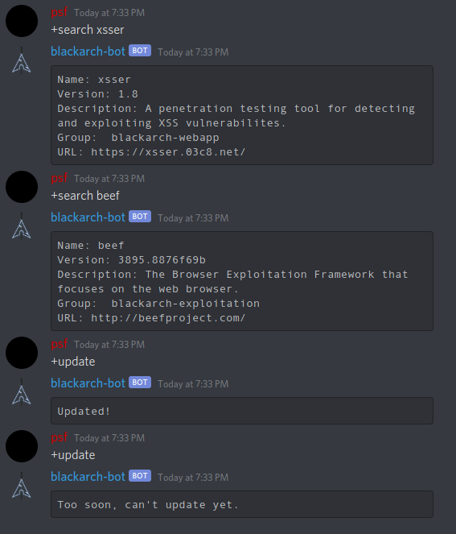

# BlackArch Discord Bot

A Discord Bot written in Go to search for packages.

Contributions are more than welcome, however, keep in mind we like things simple.



## Dependencies

- bwmarrin's Discord Go Library: https://github.com/bwmarrin/discordgo

```bash
go get github.com/bwmarrin/discordgo
```

*Note*: considering you have `go` in your `PATH`.

## Usage

To run the bot you need a Discord Application (Bot) Token:
https://discord.com/developers/docs/topics/oauth2#bots

```bash
make clean run TOKEN='*'
```

## TODO

- [ ] Package search optimization;
- [ ] Proper directory structure (`src`, etc.);
- [ ] Split code base in multiple files (specially one to handle the triggers);

